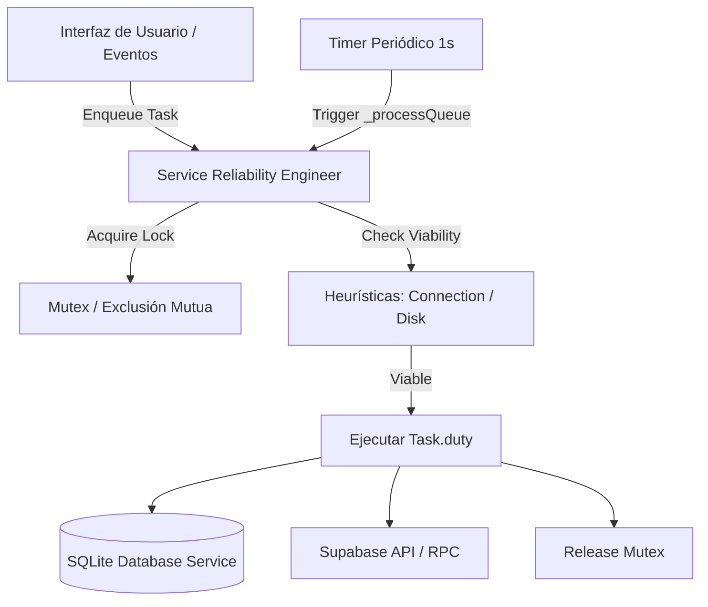

# Sincronización y Motor SRE (Service Reliability Engineer)

El **Service Reliability Engineer (SRE)** es el motor central encargado de administrar la ejecución de tareas asíncronas, garantizar el funcionamiento offline y sincronizar la información con la nube de forma resiliente.

---

## 1. Arquitectura del SRE

El SRE ([service_reliability_engineer.dart](../../lib/models/SRE/service_reliability_engineer.dart)) opera mediante una arquitectura basada en los patrones **Mediator** y **Command**:

### Componentes Clave:
- **`_tasksRepository`**: Catálogo que mapea identificadores de tarea a objetos [Task](../../lib/models/SRE/Task/task.dart).
- **`_tasksQueue`**: Cola FIFO de nombres de tareas pendientes por ejecutar.
- **`_busy`**: Instancia de `Mutex` que impide ejecuciones concurrentes simultáneas sobre la base de datos local o la red.
- **Timer Periódico**: Un temporizador ejecutado cada segundo que invoca `_processQueue()`.

---

## 2. Catálogo de Tareas Registradas

| Tarea | Heurística Requerida | Dependencias | Descripción |
|---|---|---|---|
| `LoadFromDisk` | `DiskHeuristic` | Ninguna | Carga el estado inicial, la caché de usuarios y la cola de formularios desde SQLite hacia la memoria. |
| `SaveToDisk` | `DiskHeuristic` | Ninguna | Procesa tareas de escritura por lote pendientes en el sistema local. |
| `SetUser` | `ConnectionHeuristic` | Ninguna | Establece la identidad del usuario actual autenticado en la sesión. |
| `RefreshUsers` | `ConnectionHeuristic` | `LoadFromDisk` | Consulta padrón de nombres, roles y jerarquías desde Supabase y actualiza la caché local en SQLite. |
| `SetForms` | `ConnectionHeuristic` | Ninguna | Consulta registros remotos en Supabase y los guarda en SQLite aplicando el Guard de Precedencia Local. |
| `SyncForms` | `ConnectionHeuristic` | `LoadFromDisk` | Procesa el buzón de salida: envía todos los formularios finalizados (`status = 1`) a la nube. |
| `UpdateTemplate` | `ConnectionHeuristic` | `LoadFromDisk` | Descarga la versión más reciente de la plantilla de formulario desde Supabase. |
| `RefreshTemplates` | `ConnectionHeuristic` | Ninguna | Sincroniza todas las plantillas almacenadas localmente con las definiciones de la nube. |
| `IsUpdateAvailable` | `ConnectionHeuristic` | `LoadFromDisk` | Consulta al canal nativo la disponibilidad de versiones de la app más recientes. |
| `UpdateApp` | `ConnectionHeuristic` | `SaveToDisk` | Inicia la descarga e instalación automática del paquete ejecutable de la app. |

---

## 3. Ciclo de Sincronización de Formularios

El envío de un formulario de atención prehospitalaria hacia la nube sigue el siguiente flujo de estados y reintentos:

1. **Creación / Edición (`status = 0`)**:
   - El formulario se guarda en la base de datos SQLite con estado `0` (Borrador) mediante `enqueueForm()`.
2. **Finalización (`status = 1`)**:
   - El usuario presiona "Finalizar". Si las validaciones del formulario son exitosas, el estado cambia a `1` (Finalizado / Pendiente de envío).
   - Se guarda el registro en SQLite y el SRE encola automáticamente la tarea `SyncForms`.
3. **Procesamiento por `SyncForms`**:
   - El SRE valida que exista conexión mediante `ConnectionHeuristic`.
   - Se extraen todos los formularios con `status = 1` ordenados por fecha.
   - Para cada formulario, se invoca la función RPC `upload_filled_in` en Supabase.
4. **Respuesta del Servidor**:
   - **Éxito**: La función RPC registra el formulario en la nube con estado `2`. En el cliente, `uploadForm()` actualiza el estado local en SQLite a `2` (Sincronizado).
   - **Fallo (ej. Caída de red)**: `uploadForm()` retorna `false`, deteniendo el ciclo de envío. El formulario permanece en SQLite con `status = 1` y con todo su contenido intacto.
5. **Reintento Automático**:
   - En cuanto la red se restablece o el temporizador del SRE se activa, `SyncForms` se reejecuta sin intervención del usuario.
